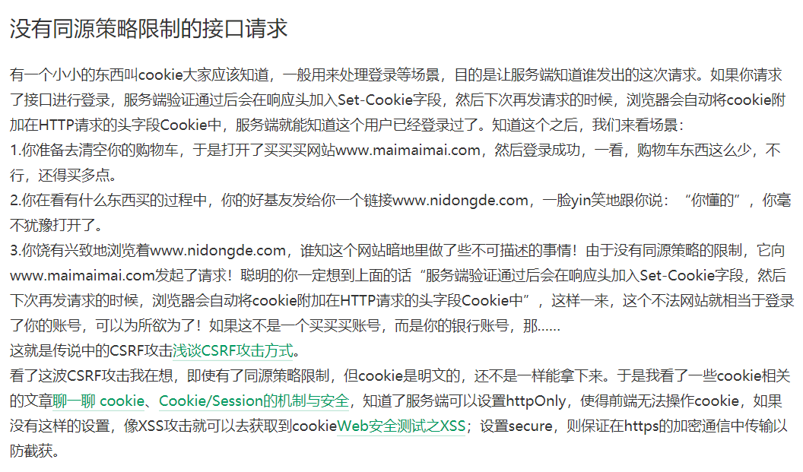
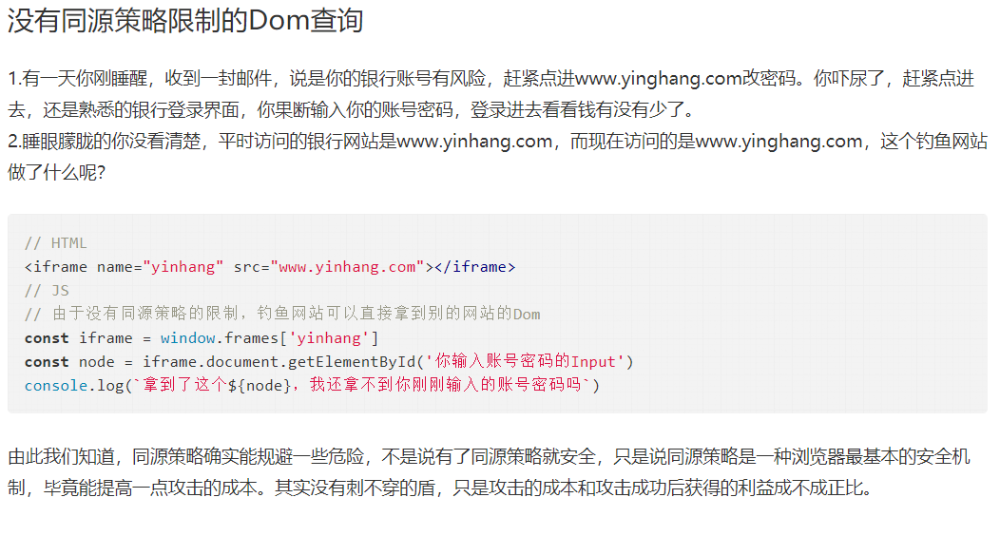

# 同源策略
- **同源**：如果两个页面的协议protocol，端口port，主机host都相同，则两个页面具有相同的源
- **同源策略**：限制了从一个源加载的文档或脚本，如何与另一个源的资源进行交互。是一种约定，是浏览器最核心也最基本的功能。
- 用于：隔离潜在恶意文件
- Web是构建在同源策略之上的，浏览器只是对同源策略的一种实现。
## 浏览器实现同源策略
- 针对接口的请求
- 针对Dom的查询

## 非同源的限制
1. 无法读取非同源网页的 Cookie、LocalStorage 和 IndexedDB
2. 无法接触非同源网页的 DOM
3. 无法向非同源地址发送 AJAX 请求

# 跨域
- 浏览器的同源策略导致了跨域
## 跨域的场景
- 协议、端口、主机任何一个不同都导致跨域
- 域名 和 域名对应的IP地址 也跨域
## 解决方法
1. JSONP
在HTML标签中，比如script、img这样的标签获取资源是没有跨域限制的
