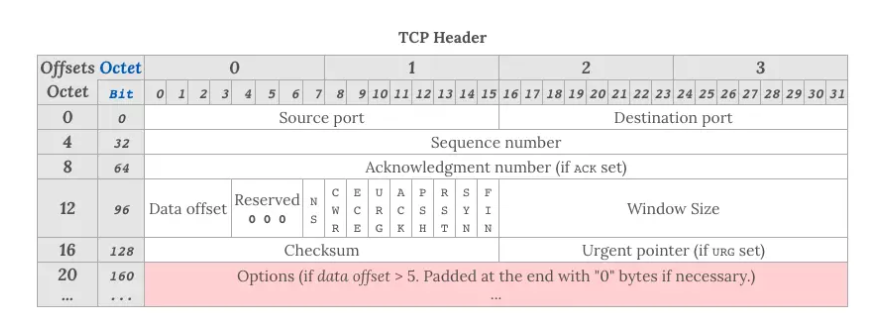

TCP头部字段：

- `Sequence number`，这个序号保证了 TCP 传输的报文都是有序的，对端可以通过序号顺序的拼接报文
- `Acknowledgement Number`，这个序号表示数据接收端期望接收的下一个字节的编号是多少，同时也表示上一个序号的数据已经收到
- `Window Size`，窗口大小，表示还能接收多少字节的数据，用于流量控制
- 标识符
  - URG=1：该字段为一表示本数据报的数据部分包含紧急信息，是一个高优先级数据报文，此时紧急指针有效。紧急数据一定位于当前数据包数据部分的最前面，紧急指针标明了紧急数据的尾部。
  - ACK=1：该字段为一表示确认号字段有效。此外，TCP 还规定在连接建立后传送的所有报文段都必须把 ACK 置为一。
  - PSH=1：该字段为一表示接收端应该立即将数据 push 给应用层，而不是等到缓冲区满后再提交。
  - RST=1：该字段为一表示当前 TCP 连接出现严重问题，可能需要重新建立 TCP 连接，也可以用于拒绝非法的报文段和拒绝连接请求。
  - SYN=1：
    - 当SYN=1，ACK=0时，表示当前报文段是一个连接请求报文。
    - 当SYN=1，ACK=1时，表示当前报文段是一个同意建立连接的应答报文。
  - FIN=1：该字段为一表示此报文段是一个释放连接的请求报文。
