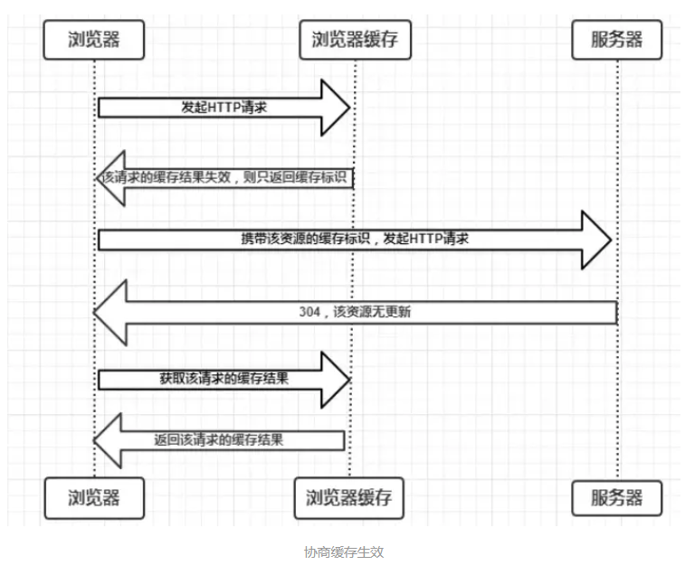
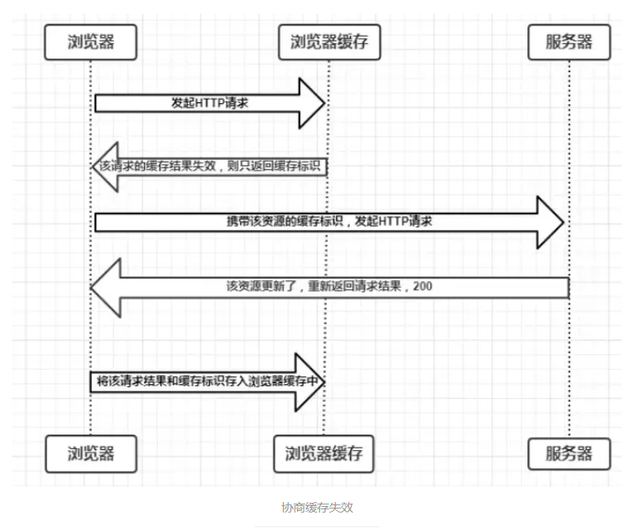

# 协商缓存
- 协商缓存：**强缓存失效后，浏览器携带缓存标识向服务器发起请求，由服务器根据缓存标识决定是否使用缓存的过程。**

有以下两种情况
- ❗ 协商缓存生效，返回 304 和 Not Modified
- ❗ 协商缓存失效，返回 200 和 请求结果

协商缓存可以通过两种 HTTP Header 设置：
1. Last-Modified ：根据文件修改时间来决定是否缓存
2. Etag : 根据文件内容是否修改来决定缓存策略

## 1.Last-Modified 和 If-Modified-Since
浏览器在第一次请求资源时，服务器接收到请求后返回的响应头中包含 Last-Modified，是所请求的资源最后一次修改的时间。

浏览器下一次请求时，会在请求头中加上 `If-Modified-Since` 这个字段，值等于上一次接收到的 Last-Modified 的值，服务器收到请求报文后，会将 If-Modified-Since 与服务器中最后一次修改的时间作对比。

如果等于最后一次修改时间就表示资源未更新，协商缓存生效，服务器返回 304 和 Not Modified ，浏览器直接从缓存读取资源；如果小于最后一次修改时间，就表示资源已更新，协商缓存失效，服务器会返回 200 和 浏览器请求的结果。

### Last-modified 的弊端
- 如果本地打开缓存文件，即使没有对文件进行修改，但还是会造成 Last-Modified 被修改，导致服务器发送相同的资源
- Last-Modified 只能以秒计时，如果在不可感知的时间内修改完文件，那么服务器会以为资源还是命中了，不能返回正确的结果

根据文件修改时间来决定缓存策略尚有不足，能否根据文件是否修改来决定缓存策略呢？所以，在HTTP/1.1中出现了 `ETag` 和 `If-None-Match`。

## 2. ETag 和 If-None-Match
ETag 是服务器响应请求时，返回当前资源文件的一个标识(由服务器生成)，只要资源有变，Etag 就会重新生成。

浏览器下一次向服务器请求资源时，会将上一次返回的 ETag 值放在请求头部字段 If-None-Match 中，服务器只需要比较传来的 If-None-Match 跟自己服务器上该资源的 ETag 是否一致。

如果一致，直接返回 304 通知浏览器使用本地缓存即可；如果不一致，就以正常的 HTTP 响应报文格式返回 200 和新的浏览器请求的资源。

## Last-Modified 与 ETag 对比
- 精确度上：ETag 高于 Last-Modified
- 性能上：ETag 不如 Last-Modified，毕竟Last-Modified 只需要记录时间，而 ETag 需要服务器通过算法计算出一个 hash 值。
- 优先级上：服务器校验优先考虑 ETag。

