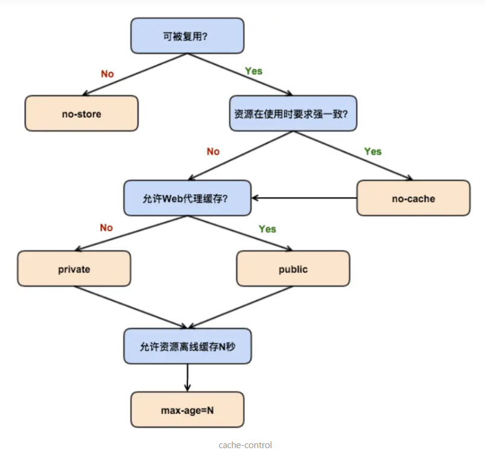

# 强缓存

- **不会向服务器发送请求，直接从缓存中读取资源**。

强缓存可以通过设置两种 HTTP Header 实现：
- Expires
- Cache-Control

强缓存判断是否缓存的依据：是否超出某个时间或者时间段，而不关心服务器端文件是否已经更新，这可能导致加载的文件不是最新的内容。

**如何获知服务器端内容是否发生了更新？** 这时需要用到 **协商缓存。**

## 1. Expires

Expires 是 Web 服务器**响应头部字段**，在响应 http 请求时，告诉浏览器可以在过期时间之前从浏览器缓存数据，无需再次请求，状态码为 200。

缓存过期时间，是服务器端的具体时间点。

Expires = max-age + 请求时间，需要和 last-modified(内容的最后修改时间)

Expires 是 HTTP/1 的产物，受限于本地时间，如果修改了本地时间，可能会造成缓存失效。

## 2. Cache-Control
- Cache-Control 是 HTTP/1.1 中最重要的规则

- 在**请求头或响应头**中设置，并且可以**组合使用多种指令**

指令| 作用
--|--
public | 表示响应可以被客户端和代理服务器缓存
private | 表示响应只可以被客户端缓存，中间代理服务器不可以缓存
max-age=60 | 在这个请求正确返回时间的一分钟内再次加载资源，就会命中强缓存。缓存一分钟后过期，需要重新请求。
s-maxage | 覆盖 max-age ，作用一样，只在代理服务器中生效。
no-store | 不缓存任何响应
no-cache | 资源被缓存，但是立即失效，下次会发起请求验证资源是否过期
max-stale=30 | 30秒内，即使缓存过期，也使用该缓存
min-fresh | 希望在30秒内获取最新响应

## 两者的比较
- Expires 是 HTTP/1 的产物，Cache-Control 是 HTTP/1.1 的产物
- 两者同时存在，Cache-Control 的优先级高于 Expires

