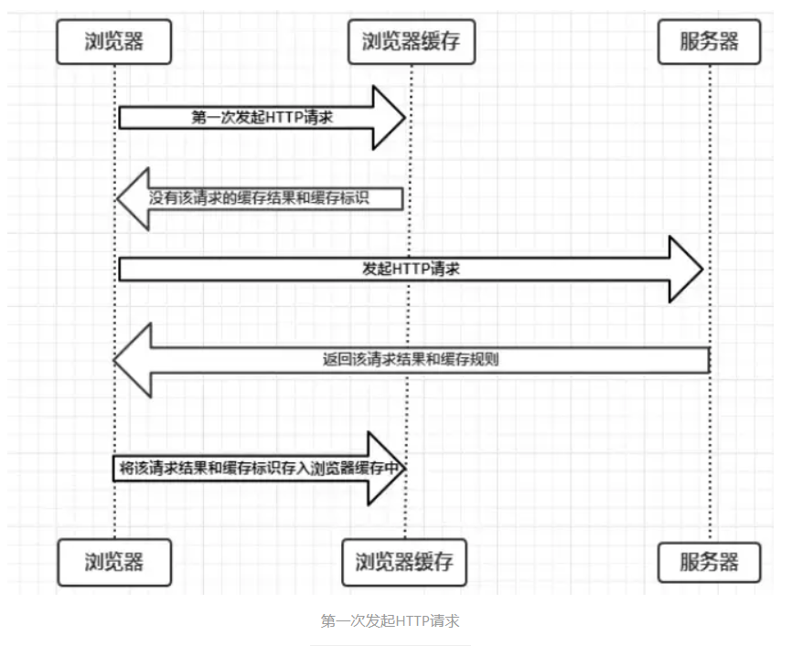
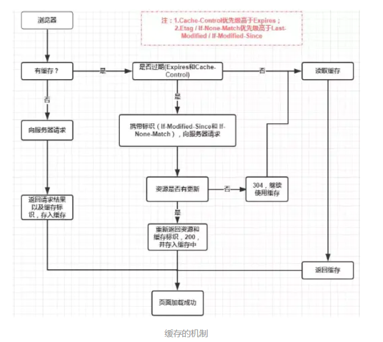

# 缓存机制

浏览器与服务器通信的方式为**应答**模式，浏览器发起 HTTP 请求，服务器响应该请求。

浏览器第一次向服务器发起该请求后，拿到请求结果后，将请求结果和缓存标识存入浏览器缓存，浏览器对于缓存的处理是根据第一次请求资源时返回的响应头来确定的。

- 浏览器每次发起请求，都会在浏览器缓存中查找该请求的结果及缓存标识。
- 浏览器每次拿到返回的请求结果都会将该结果和缓存标识存入浏览器缓存中。

据是否需要向服务器重新发起HTTP请求将缓存过程分为两个部分，分别是强缓存和协商缓存。

- 强缓存优于协商缓存进行，若强缓存(Expires 和 Cache-Control)生效则直接使用缓存，若
失效则进行协商缓存(Last-Modified/If-Modified-Since 和 ETag/If-None-Match)，协商缓存由服务器决定是否使用缓存，若协商缓存失效，则表示该请求的缓存失效，返回 200 和 请求的资源，若协商缓存生效，则返回 304 Not Modified，继续使用本地缓存。

❓：**如果什么缓存策略都没有设置，那么浏览器会怎么处理？**

✍🏻：对于这种情况，浏览器会采用一个启发式的算法，通常会取响应头中的 Date 减去 Last-Modified 的值的 10% 作为缓存时间。

