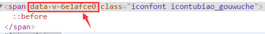
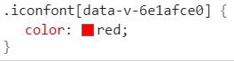

添加了**scoped属性**的组件，为了达到样式私有化，会执行两个操作：
1. 给HTML的DOM节点加一个不重复的**data属性**(形如：data-v-2311c06a)

2. 给每句css选择器的末尾(编译后生成的css语句)，加一个当前组件的**data属性选择器**(如[data-v-2311c06a])来私有化样式
  
    

scoped 解决了样式私有化的问题，但同时也带来了新的问题-样式不易修改，而很多时候，我们需要对公共组件的样式做微调的。

解决方法：vue-loader的深度作用选择器[vue-loader之scoped-css](https://vue-loader-v14.vuejs.org/zh-cn/features/scoped-css.html)