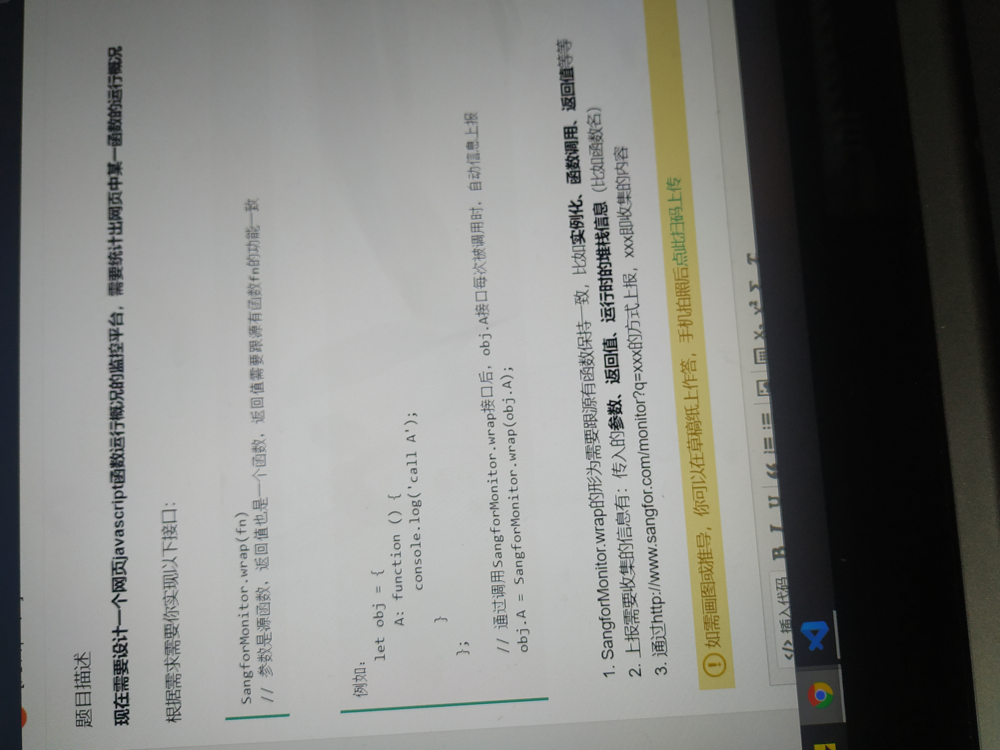

## 1. a标签的 target 属性
对一个没有嵌入在 < iframe > 中的 < a href="./go" > 元素，当给a配置哪个 target 后可以做到在点击链接时覆盖掉当前页面：( _self )

## 2. 
```
let arr = ['a','b']
for(let key in arr){
  console.log(key)   //0  1
}
for(let key of arr){
  console.log(key)  //a b
}
```
- for in遍历的是数组的索引（即键名），而for of遍历的是数组元素值。
- for in 遍历的是不包括数组的原型属性method和索引name,for of遍历的只是数组内的元素
- 

## 3. 在chrome下面，可以把一个 < button > 设置成 disabled 的方式有：
- button.setAttribute('disabled',true)
- button.disabled = true

## 4. HTTP响应头中的Content-length 
A. Content-Length 的值仅包含HTTP实体主体部分的长度

B. Content-Length 的值为未编码的原始数据的长度

C. Content-Length 的值包含HTTP头部和实体主体部分的长度

D. Content-Length 的值为编码后的数据的长度

## 5.
```
let oo ={
  get sangfor(){
    console.log('get')
  },
  set sangfor(v){
    console.log('set')
  }
}
oo.sangfor = '100'
console.log(oo.sangfor) 
```
输出的结果是： set、get、undefined

## 6. HTTP头部信息 set-cookie
```
cache-control:nostore,no-cache,must-revalidate,post-check=0,pre-check=0
connection:close
cotent-type:text/html;charset=utf-8
data:Web,09 Aug 2017 07:43:07 GMT
set-cookie:PHPSESSID=e8jidjai; domain=.sangfor.com.cn; path:/; secure:HttpOnly
transfer-encoding:chunked
```
A. 访问 https://test.sangfor.com.cn:8899 时 cookie 会生效
B. 使用 document.cookie 可以输出该 cookie 的值
C. 访问 https://test1.sangfor.com.cn时cookie 会生效
D. 访问 https://test.sangfor.com.cn/path/index.html时 cookie 会生效
E. 关闭浏览器后，cookie会自动被浏览器清除

## 7. 跨域
以下可以跨域 POST 数据的方式有：
A. 使用AJAX
B. 使用< form>标签发请求
C. 使用JSONP
D. 使用< img>标签发请求
E. 使用< script>标签发请求


## 8.文字上下居中
对于高度为100px的<div>sangfor</div>,其中文本在单行显示，以下哪个样式可以对文字上下居中：
A. padding-top:50px; margin-top:-50%;
B. vertical-align:middle
C. padding-top:50px;
D. line-height:100px;

## 9. 网段
以下IP跟200.200.67.254/22同一网段的有
A. 200.200.66.8
B. 200.200.67.8
C. 200.200.65.8
D. 200.200.68.8

## 10.在新版chrome中，对于以下代码对class的使用，正确的：
```
class Base{
  constructor(){
    this.name = 'base'
  }
}
class Test extends Base{
  name = 'sangfor'
  constructor(){
    this.name='Test'
    super()
  }
}
```
A. Test 中成员属性 name='sangfor';脚本出错，不支持该语法
B. Test中this.name='Test';脚本出错
C. Test中成员属性 name="sangfor"；脚本出错，正确使用方式为 name：'sangfor'
D. Test 中super调用可以改成 super.constructor()

## 11.
```
  function A(){}
  function B(){A.call(this)}
  B.prototype = Object.create(A.prototype)
  let b = new B()
  function C(){A.call(this)}
  let c = new C()
  Object.setPrototypeOf(c,A.prototype)

  console.log(b instanceof A)
  console.log(c instanceof A)
```
输出：

## 12.
```
function Sangfor(name){
  return this.name = name
}
console.log([0,'0',[],{},null].map(i=> typeof new Sangfor(i).name))    
```
输出：

## 13. 判断变量是否为数组

多写几种方法

## 14.对于WEB服务器权限访问控制方法不安全的有：
A. 基于登录用户 HTTP 不同自定义头部的访问控制
B. 基于登录用户 cookie 中令牌信息的访问控制
C. 基于登录用户URL不同参数的访问控制
D. 所有选项方式都是安全可接受的

## 15. 在HTTP/2下，以下哪些WEB性能优化意义不大：
A. 启用 gzip 压缩 HTTP实体内容
B. 对于图片等不需要校验 cookie 的资源文件，设置禁用 cookie 的域名
C. 使用多域名的方案突破浏览器对单个域名的并发连接数
D. 把很多小图片拼合成一张大图片(scripting),减少 HTTP 请求数量

## 16. genertor

```
  function* gen(n){
    let value = yield n*2+1
    console.log(value)
  }
  let f = gen(20)
  f.next(1)
  f.next(2)

```
输出：

## 17. 盒模型

## 18.在"use strict"模式下，禁止的操作

## 19.
```
    let C = function(){}
    C.prototype = Object.create({
      option:{
        name:'c'
      }
    })
    let c1 = new C()
    let c2 = new C()
    c1.option.name = 'new_C'
    console.log(c2.option.name)
    c1.option = null
    console.log(c2.option.name)

```

## 20. 有效防止WEB站点被中间人攻击的方式

## 21. CSRF攻击

## 22. div h2:nth-child(odd),匹配的是哪些节点

## 23.算法题：
输入一个URL和一个字符串，判断URL中是否有这个参数

## 24.算法题：
实现 nodejs 中的path.join 功能 。

限制条件：
1. 目录之间都以"/"分割，无需考虑windows的情况
2. 目录名称不允许输入",",逗号仅作为分隔符，无需考虑
3. 目录分隔符为/，\不作为目录分隔符，只认为是单个合法字符

输入：输入只有一行，即合法的路径，多个路径之间使用逗号，分隔

输出：格式后的路径

示例:
> 输入：/,abc,def,g
>
> 输出：/abc/def/g
>
> 输入：a,b,c,../d/
>
> 输出：a/b/d/

## 25. 



